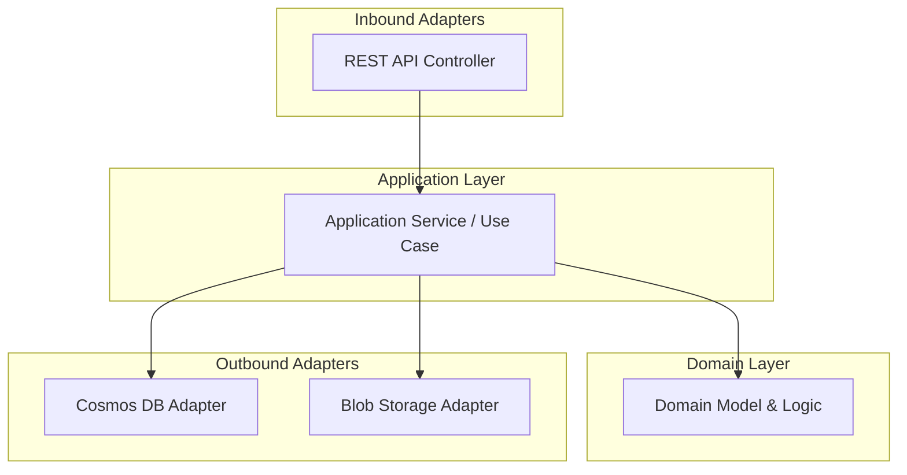

## Architecture Diagrams

### High-Level Solution Architecture
```mermaid
flowchart LR
   Client[Client / Consumer]
   APIGW[Azure API Management (API Gateway)]
   Service[.NET Microservice (Docker, AKS/Container Apps)]
   Cosmos[Azure Cosmos DB (Metadata)]
   Blob[Azure Blob Storage (Files)]
   KeyVault[Azure Key Vault]
   Datadog[Datadog (Monitoring)]

   Client --> APIGW
   APIGW --> Service
   Service --> Cosmos
   Service --> Blob
   Service --> KeyVault
   Service -.-> Datadog
```

### Hexagonal Architecture (Ports & Adapters)


### CI/CD Pipeline Overview
```mermaid
flowchart LR
   Dev[Developer]
   GitHub[GitHub Repository]
   Actions[GitHub Actions (CI/CD)]
   Azure[Azure (AKS/Container Apps, Resources)]

   Dev --> GitHub
   GitHub --> Actions
   Actions --> Azure
```

# Design Document

## Project Overview
This document, authored from the perspective of a Principal Architect with extensive experience in designing robust, cloud-native microservices, outlines the technology stack and architecture for the File Ingestion project. The solution is designed for high scalability, resilience, and maintainability, targeting a minimum of 100 requests per second (RPS) as per the SLA, with headroom for future growth.


## Technology Stack
- **Backend:** .NET (C#), leveraging ASP.NET Core for high-performance APIs
- **Architecture:** Hexagonal Architecture (Ports and Adapters) for separation of concerns and testability
- **Infrastructure as Code:** Terraform for full environment automation and repeatability
- **Cloud Provider:** Azure (leveraging managed services for reliability and scalability)
- **Database:**
   - Azure Cosmos DB (NoSQL, globally distributed, for metadata)
   - Azure Blob Storage (for file storage, scalable and cost-effective)
- **Containerization:** Docker (enables consistent deployment and local development)
- **Orchestration:** Azure Kubernetes Service (AKS) or Azure Container Apps for automated scaling, rolling updates, and self-healing
- **API Gateway:** Azure API Management for secure, scalable, and observable API exposure
- **CI/CD:** GitHub Actions (automated build, test, security scan, and deployment pipelines)
- **Monitoring & Observability:**
   - OpenTelemetry for distributed tracing and metrics
   - Datadog for centralized monitoring, alerting, and dashboards
- **Security:**
   - Azure Key Vault for secrets management
   - Managed identities for secure service-to-service communication
   - Network security groups and private endpoints for data protection

## Architecture


### Hexagonal Architecture (Ports and Adapters)
- **Domain Layer:** Pure business logic and domain models, fully decoupled from infrastructure and frameworks.
- **Application Layer:** Orchestrates use cases, enforces business rules, and interacts with domain via interfaces (ports).
- **Adapters:**
   - **Inbound Adapters:** REST API controllers (ASP.NET Core), potential for future event-driven adapters (e.g., Azure Service Bus)
   - **Outbound Adapters:** Implementations for Cosmos DB, Blob Storage, and any external integrations
- **Infrastructure Layer:** Implements outbound ports using Azure SDKs, storage clients, and other platform-specific libraries


### High-Level Solution Flow
1. **Request Handling:**
   - Azure API Management (API Gateway) receives and authenticates requests.
   - Requests are routed to the .NET microservice running in Docker containers on AKS or Azure Container Apps.
2. **Application Logic:**
   - REST controllers (inbound adapters) invoke application services (use cases) via defined ports.
   - Application services interact with the domain layer and call outbound ports for persistence and integration.
3. **Persistence & Integration:**
   - Outbound adapters interact with Azure Cosmos DB for metadata and Azure Blob Storage for file content.
   - All data access is abstracted behind interfaces for testability and flexibility.
4. **Scalability & Resilience:**
   - Multiple container instances are deployed and auto-scaled based on load (CPU, memory, or custom metrics).
   - Health probes and readiness checks ensure only healthy instances receive traffic.
   - Rolling updates and zero-downtime deployments are enabled via orchestrator.
5. **Infrastructure as Code:**
   - Terraform scripts provision all Azure resources, including networking, security, compute, storage, and monitoring.
6. **Monitoring & Observability:**
   - OpenTelemetry is used for distributed tracing, metrics, and logging.
   - All telemetry is exported to Datadog for real-time monitoring, alerting, and dashboarding.
7. **Security:**
   - All secrets are stored in Azure Key Vault and accessed via managed identities.
   - Network security groups and private endpoints restrict access to sensitive resources.


## SLA & Cloud-Native Considerations
- **Performance:**
   - Horizontally scalable microservices using AKS/Container Apps and API Gateway
   - Asynchronous processing and batching where appropriate
   - Optimized access patterns for Cosmos DB and Blob Storage
- **Reliability & Resilience:**
   - Health checks, auto-scaling, and self-healing containers
   - Retries, circuit breakers, and fallback strategies for external dependencies
   - Automated backup and disaster recovery for data
- **Security:**
   - End-to-end encryption (in transit and at rest)
   - Principle of least privilege for all identities and resources
   - Regular security scanning in CI/CD
- **Observability:**
   - Distributed tracing, metrics, and logs via OpenTelemetry
   - Centralized monitoring and alerting in Datadog
   - Proactive alerting for SLA breaches and anomalies


## Next Steps
- Define detailed component and sequence diagrams
- Specify API contracts (OpenAPI/Swagger) and data models
- Establish initial Terraform scripts for Azure resource provisioning
- Scaffold .NET solution with hexagonal architecture structure
- Set up CI/CD pipelines in GitHub Actions (build, test, security, deploy)
- Implement observability instrumentation (OpenTelemetry)
- Define security policies and access controls
